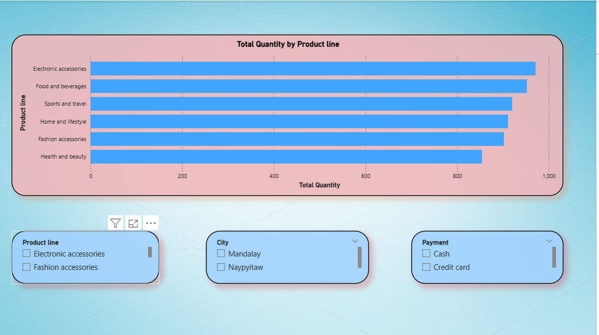
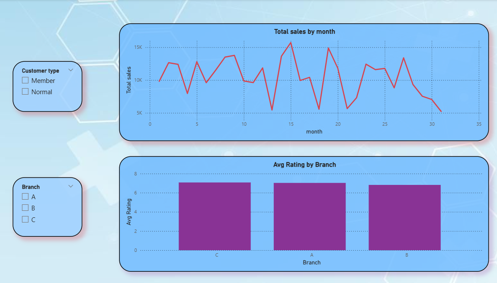
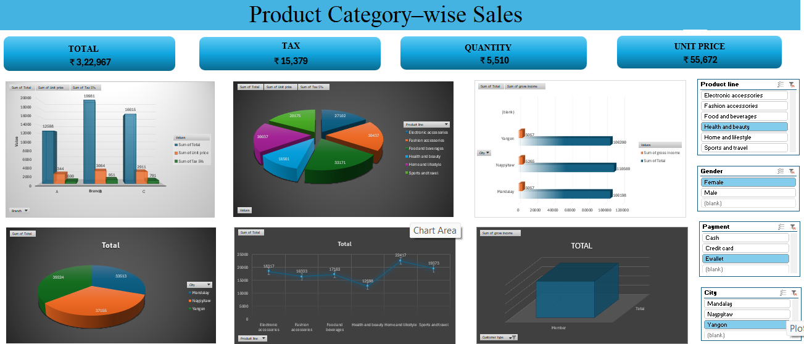

# Retail Sales Analytics 

##  Project Overview

This project presents an end-to-end Retail Sales Analytics solution built to analyze supermarket transaction data and generate actionable business insights.  

It demonstrates the complete data analytics lifecycle including data cleaning, SQL-based KPI calculation, exploratory data analysis (EDA), and interactive dashboard development using Power BI.

---

##  Business Objectives

- Analyze overall sales performance and revenue trends  

- Identify top-performing branches and product categories  

- Understand customer purchasing behavior  

- Evaluate payment method distribution  

- Track monthly sales growth patterns  

---

## Tools \& Technologies

- **Microsoft Excel** – Data Cleaning & Formatting  
- **MySQL** – Business Querying & KPI Calculation  
- **Python (Pandas, Matplotlib)** – Exploratory Data Analysis  
- **Power BI** – Interactive Dashboard Development  

---

## Key Performance Indicators (KPIs)

- Total Revenue  

- Total Transactions  

- Gross Income  

- Average Customer Rating  

- Branch-wise Sales  

- Product Line Performance  

- Monthly Sales Trend  

---

##  Project Workflow

###  Data Cleaning (Excel)

- Removed missing values  

- Standardized column formats  

- Formatted date and currency fields  

- Ensured data consistency  

### SQL Analysis (MySQL)

- Calculated Total Revenue  

- Aggregated Monthly Sales  

- Analyzed Branch-wise Performance  

- Product Category Analysis  

- Customer Type Segmentation  

### Python Exploratory Data Analysis

- Revenue distribution analysis  

- Category-wise sales visualization  

- Payment method breakdown  

- Trend analysis using line charts  

- Customer rating analysis  

###  Power BI Dashboard Development

- KPI Cards (Revenue, Transactions, Gross Income, Avg Rating)  

- Sales by Branch  

- Product Category Analysis  

- Payment Method Distribution  

- Monthly Sales Trend  

- Interactive Slicers  

---

##  Key Insights

- A small number of product categories contribute to the majority of total sales  

- Certain branches significantly outperform others in revenue generation  

- E-wallet and cash are the most preferred payment methods  

- Monthly sales show noticeable seasonal fluctuation patterns  

- Higher customer ratings correlate with higher purchase values  

---

##  Dashboard Preview

---

##  Business Impact

This dashboard enables retail decision-makers to:

- Identify high-performing branches and product lines  

- Optimize inventory planning  

- Improve marketing strategies based on customer behavior  

- Monitor financial performance through real-time KPIs  

---

##  Skills Demonstrated

- Data Cleaning \& Preprocessing  

- SQL Query Writing \& Aggregation  

- KPI Development  

- Exploratory Data Analysis (EDA)  

- Data Visualization \& Dashboard Design  

- Business Insight Generation  

---

##  Conclusion

This project showcases an end-to-end retail analytics pipeline transforming raw transactional data into meaningful insights and an interactive Power BI dashboard.  

It highlights strong analytical, technical, and business intelligence skills aligned with Data Analyst and Business Intelligence roles.

<!--  -->

